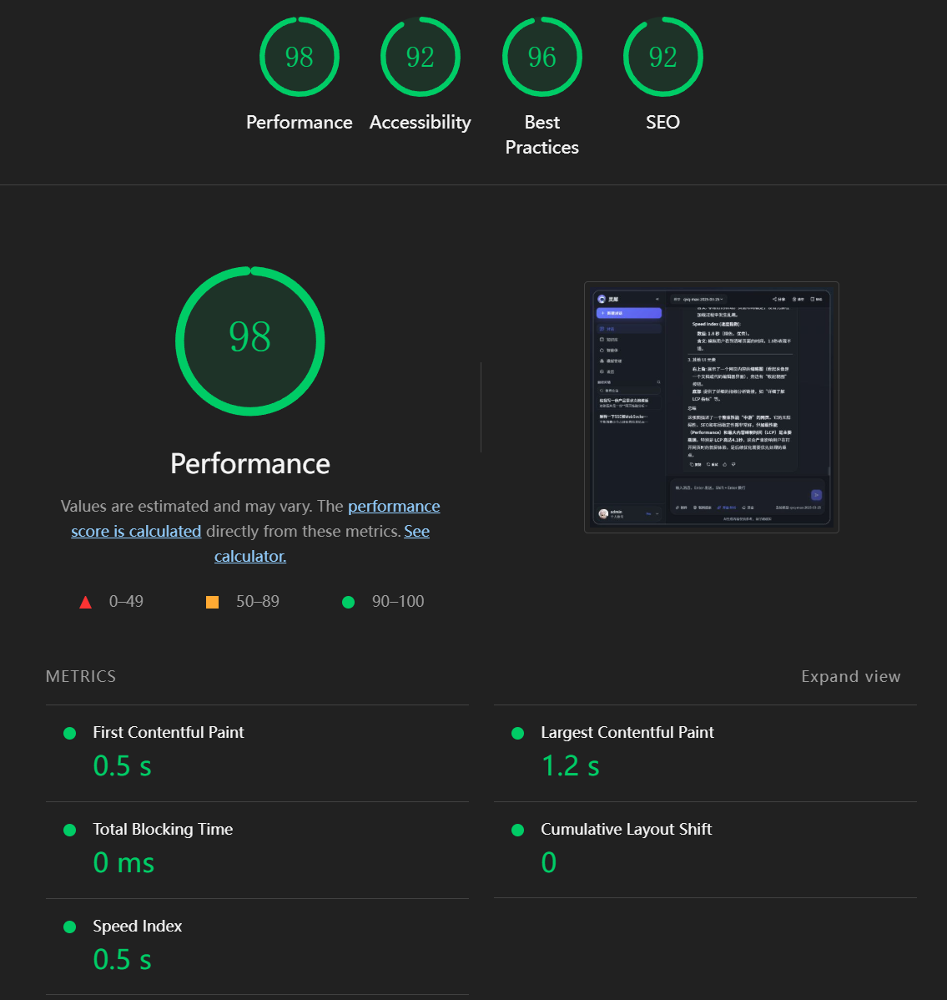
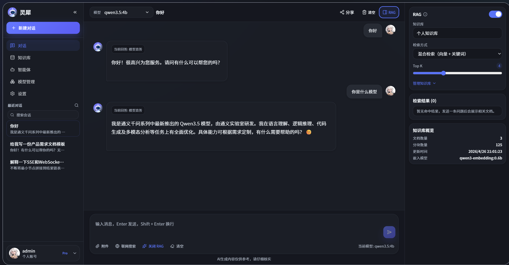
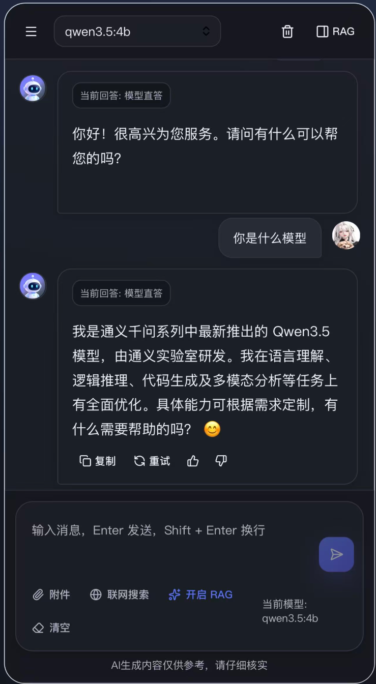
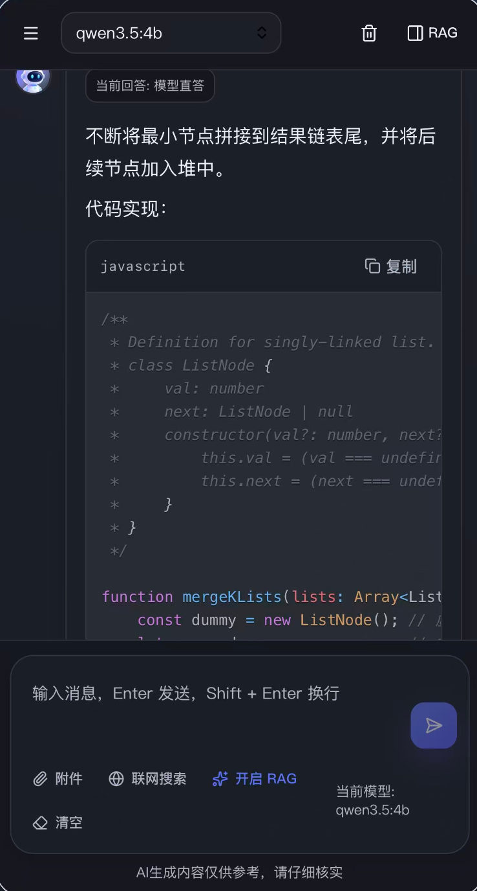
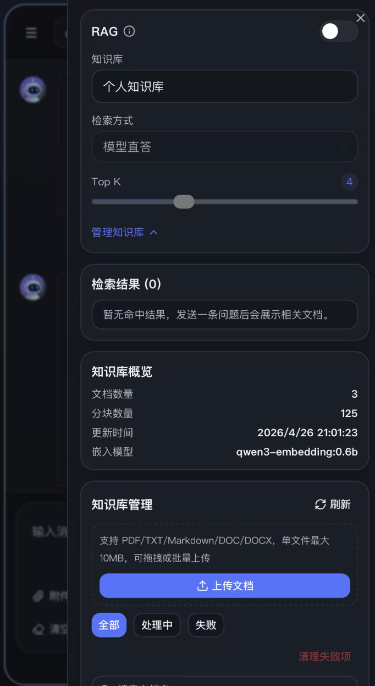
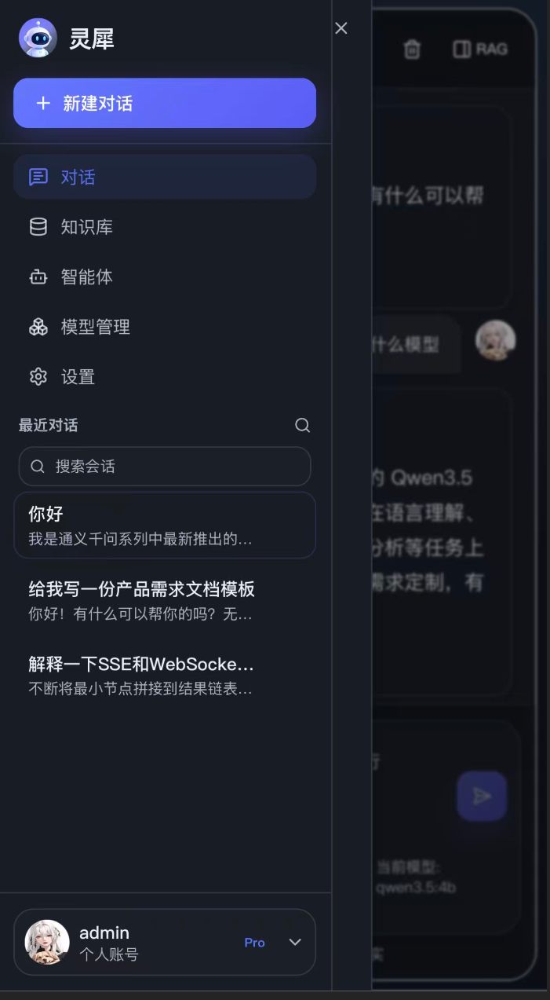

基于 RAG 技术的私有文档知识库问答系统

基于 RAG（检索增强生成） 架构实现私有文档智能问答系统，支持用户上传个人文档并构建专属知识库。系统对文档进行智能分块与结构化存储，同时构建文本索引与向量表征，依托 MongoDB 实现混合存储与高效检索。

系统内置四种问答模式：模型原生直答、关键词全文检索、语义向量检索及混合检索增强模式。其中混合检索通过融合稀疏文本匹配与稠密向量语义召回，兼顾专业术语、编号等精确查询与自然语言、同义表述等模糊查询场景，再经结果融合与重排策略优化上下文质量，显著提升大模型回答的准确性、相关性与事实一致性。

整体架构轻量化、可扩展，实现了私有数据安全可控、检索精准高效、生成内容可靠可信，适用于个人文档管理、内部知识库问答等实际落地场景。

前端生产构建桌面端性能：


桌面端应用截图：


移动端截图：
 
<table>
  <tr>
    <td style="padding: 20px;"></td>
    <td style="padding: 20px;"></td>
  </tr>
  <tr>
    <td style="padding: 20px;"></td>
    <td style="padding: 20px;"></td>
  </tr>
</table>
前端相关技术栈：

核心框架：React 19
构建工具：Vite 8
样式体系：Tailwind CSS + PostCSS + tailwindcss-animate
UI 组件：Radix UI（AlertDialog、Dialog、Dropdown、Avatar 等）+ 自定义组件
状态管理：Zustand
Markdown 与代码渲染：react-markdown + remark-gfm + remark-math + rehype-katex + rehype-sanitize + react-syntax-highlighter
列表性能优化：react-virtuoso（虚拟滚动）
图标与交互提示：lucide-react + sonner
工具库：clsx + class-variance-authority + tailwind-merge

----------------------------------------------------------------

后端相关技术栈：

运行时与模块：Node.js（ESM）
Web 框架：Express 5
中间件：cors、compression、multer、dotenv
数据库：MongoDB
文件与文本处理：pdf-parse、mammoth、word-extractor、iconv-lite、jschardet
鉴权与安全相关：基于 crypto 的令牌/签名逻辑(JWT)
接口能力：SSE 流式聊天代理、文件上传、会话与消息持久化、RAG 服务（项目内模块）

## 启动

```bash
npm install
npm run dev
npm run server
点击左侧模型管理自定义配置模型
```

## 构建

```bash
npm run build
npm run preview
```
## 功能要点

- 左侧侧边栏：会话新建、重命名、删除、置顶、搜索、折叠动画
- 中间聊天区：空状态快捷提问、用户/AI气泡、消息操作栏、输入工具栏
- 右侧侧边栏：本地知识库管理、搜索模式选择、问题引用来源，会话上下文，索引重建
- Markdown：标题/列表/表格/引用/代码块（语法高亮+复制）
- SSE：流式增量渲染、停止生成、错误重试
- 右侧辅助面板：引用来源 + 上下文文档
- 会话与消息存储在 mongoDB
- 性能： 手动实现虚拟滚动
- 安全：输入基础清理 + rehype-sanitize

## 快捷键

- `Ctrl + N`: 新建会话
- `Enter`: 发送
- `Shift + Enter`: 换行
- `Ctrl + Enter`: 发送

## 目录摘要

- `src/components/layout`: 主布局
- `src/components/sidebar`: 侧边栏
- `src/components/chat`: 聊天相关组件
- `src/components/panel`: 右侧辅助面板
- `src/components/markdown`: Markdown 与代码块渲染
- `src/stores`: Zustand 状态管理
- `src/hooks`: 自动滚动、SSE 等逻辑
- `src/services`: 聊天与上传接口层
